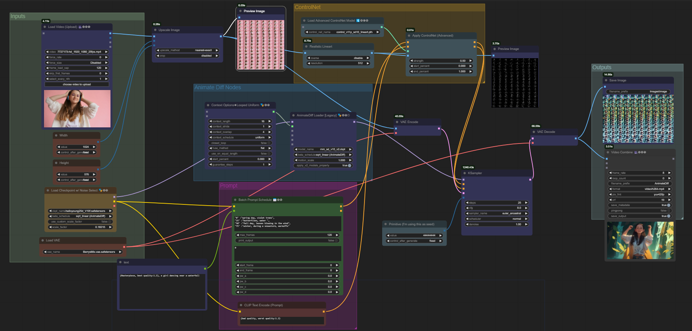

#  Video to video animation
# About the workflow
The workflow allows you to transform an input video and a specified prompt into an animated video using AnimateDiff and ControlNet. For example, you can modify an existing video based on a text prompt, such as changing a video of a girl dancing into an animated scene of the girl dancing in a forest . This process preserves the original's natural motion and structure while adapting it to a new narrative or visual style.
# Overview

- [Workflow](https://github.com/Sangamithra3/VideoToVideo/blob/main/Workflow.png)

# How to use
**Upload the Original Video**: Begin by uploading the video you want to transform using the load video node.

**Input Your Text Prompt**: Enter a clear and detailed description in the text prompt field to guide the transformation.

**Initiate the Transformation**: Click "Queue Prompt" after entering your text to start the process. The workflow uses AnimateDiff and ControlNet to analyze the original video for depth and features, applying a mask based on this analysis.

**Review and Save**: After the transformation is complete, review the new animated video and save it.

# Input Video
- [Download input video](https://github.com/Sangamithra3/VideoToVideo/blob/main/7727173-hd_1920_1080_25fps.mp4)

# Example prompts
- (Masterpiece, best quality:1.2), a girl dancing near a waterfall
- best quality, a tiger running through a forest

# Custom nodes
- AnimateDiff Evolved
- ComfyUI-VideoHelperSuite
- ComfyUI-Advanced-ControlNet
-  ComfyUI's ControlNet Auxiliary Preprocessors
-   FizzNodes

# Models
- Checkpoint model used  - helloYoung25d
- Vae model used - BerrysMix.vae.safetensors
- Controlnet model used - control_v11p_sd15_lineart.pth

# Workflow
- [Video to video animation](https://github.com/Sangamithra3/VideoToVideo/blob/main/VideoToVideo.json)

# Output Animated video
- [View output video](https://github.com/Sangamithra3/VideoToVideo/blob/main/AnimateDiff.gif)

